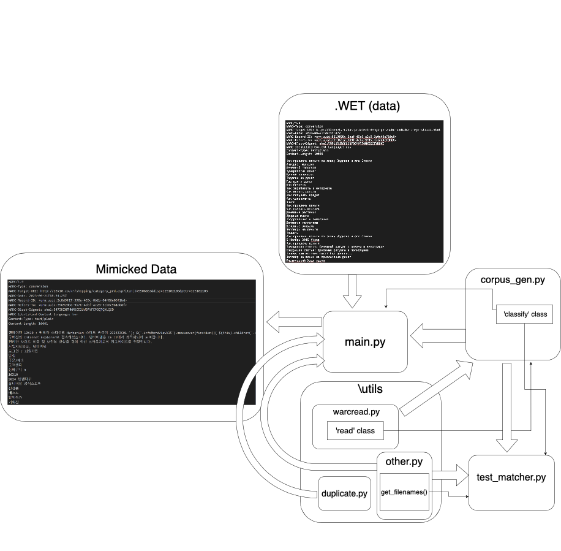
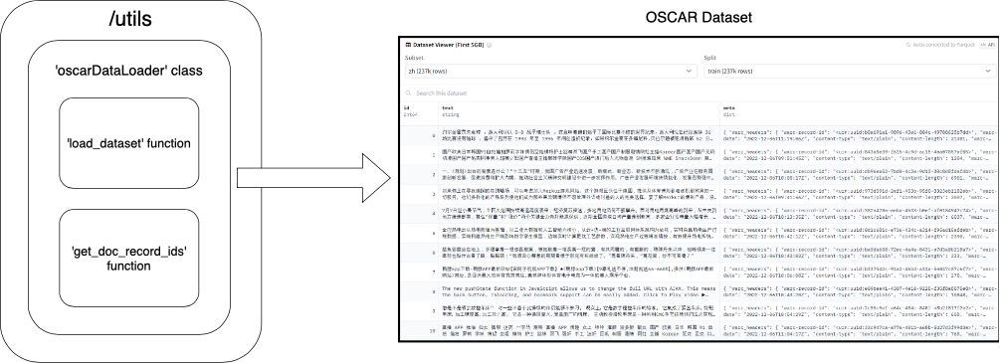

# dsan5400-group-7-final-project
Group 7 repository for OSCAR analysis research project -- DSAN 5400 final project.

## .WET Data File Used:
Due to how large the text data file is and the hassle to retrieve it, we have decided to include a Google Drive link to the sample .WET (Web Extracted Text) file we used to mimic the GoClassy pipeline for this project.

[Link](https://drive.google.com/file/d/1Y8FBBU3XI3cbL7Gy4DvYRh8peh8ERMU-/view?usp=sharing)

## General Overview of Package
The primary purpose of this final project and this resulting package is to create a mimicked pipeline of the GoClassy pipeline that was used to create the OSCAR dataset. In this package we include the steps we took to process the .WET file that we retrieved from the Common Crawl. The steps for retrieving the .WET file are listed below. 

Shown below is a scheme of the goclassy pipeline.


The initial data is from CommonCrawl and is in compressed files, which need to be extracted or read directly for processing. After decompression or direct reading, the files are typically in WET format, and WET files contain extracted text from web content. fastText, a library for efficient text classification and representation learning, is used to filter these files by language. It applies language tags to the content based on its text classification model. Once fastText has classified the files by language, the output is a set of filtered files, each tagged with a language code. Lastly, the files are grouped or classified based on their language tags. This results in a corpus of language-specific files ready for further processing or analysis.

The following tree shows the processing pipeline contents of the package:
```
goclassy
└──── generator
        ├──── generator
        │       ├──── bin
        │       │       ├──── __init__.py
        │       │       ├──── logfile.log
        │       │       └──── main.py
        │       ├──── utils
        │       │       ├──── __init__.py
        │       │       ├──── duplicate.py
        │       │       ├──── oscarDataLoader.py
        │       │       ├──── other.py
        │       │       ├──── warcread.py
        │       ├──── __init__.py
        │       └──── corpus_gen.py
        ├──── tests
        │       ├──── __init__.py
        │       └──── test_matcher.py
        ├──── pytest.ini
        └──── setup.py
```

Quick overview of each function used in our mimicked GoClassy pipeline:

The process of building a mimicked dataset of text data is overviewed in the main.py file. The functions the main.py uses can be found in the utils folder while the primary function ```corpus_gen.py``` is found at the last generator folder.

```corpus_gen.py``` is used to extract information from the given .WET data file. The function extracts the header metadata from the .WET file and also the text data body that actually contains the document of text data. This also detects the language of the text data from the header. Everything is recorded into a .csv file.

In the ```corpus_gen.py``` file, they also utilize a util function from ```warcread.py``` which basically just helps distinguish between the header and the body for the ```classify``` object in ```corpus_gen.py```.

After saving the metadata and text data body, it then uses a util function ```duplicate.py``` to remove any duplicate documents based on the header. After dropping, it rewrites back to the original .csv file.

Finally, the ```other.py``` file contains functions like ```get_filenames()```, ```get_folder_size()```, and ```format_size()```. ```get_filenames()``` takes in a folder_path to get each file name and returns a list of the file names. ```get_folder_size()``` takes the folder path and returns the total size of all files in the folder. And ```format_size()``` takes the size as input and returns the size in a human-readable format.


## Retrieving the .WET file from Common Crawl
The best method of researching the pipeline used to make the OSCAR dataset is obviously to mimic it. By doing so we can understand and possibly even improve the code structure used in constructing OSCAR. Since OSCAR's data is derived from the Common Crawl in the form of a .WET file, we had manually retrieve sample data from the Common Crawl for this project.

Here are the steps we took to retrieve a .WET file from Common Crawl:
1) Implement "Wget" command line function
2) Download index for some Crawled date from Common Crawl website (We chose 2023-40).
3) Input ```wget https://data.commoncrawl.org/[...]``` into command line.
4) ```[...]``` is replaced with a URL path from Common Crawl index:
    - We used the first URL path from the index:
    - ```crawl-data/CC-MAIN-2023-40/segments/1695233505362.29/wet/CC-MAIN-20230921073711-20230921103711-00000.warc.wet.gz```


## Diagram of Program Architecture

Shown below is a diagram of how pieces of the ‘goclassy’ package connect to one another:





- main.py imports the 'classify' class from corpus_gen.py and imports the ‘other' and ‘duplicate’ modules from the utils directory

- The utils directory consists of duplicate.py, other.py, warcread.py, and oscardataloader.py. Duplicate.py defines a function named ‘remove_duplicate', which reads a CSV file from the given path into a Pandas DataFrame. This method removes duplicate rows based on the first column of the DataFrame, and the modified DataFrame is then saved back to the original file. warcread.py defines a class named ‘read’, which handles the reading of WARC files. The ‘read_warc_record' method reads and processes a WARC record from the ‘reader’ class, in which this method checks for the WARC version and iterates through the lines to construct WARC headers. It decodes lines to UTF-8 and handles the 'content-length' field in the WARC file header. 

- The corpus_gen.py file defines a class named classify, which is involved in processing and classifying the data. This file imports the ‘read' class from warcread.py, and creates the ‘classify_files’ method which  reads from WARC files and classifies or organizes the data based on language.

- test_matcher.py imports the ‘classify' class from corpus_gen.py and imports utility functions from other.py and duplicate.py, indicating their use in the testing process. test_matcher.py defines a test function called test_numfile, which retrieves filenames from a specified directory using the ‘get_filenames’ function from other.py. The ’test_numfile’ function processes the filenames using the ‘classify' class, and then asserts a condition related to the output.


## Diagram of oscarDataLoader.py

Shown below is a diagram of getting access to the OSCAR data:





The oscardataloader.py file initializes the oscarDataLoader class. This class is structured to authenticate with the Hugging Face CLI, load the OSCAR dataset, and provide functionality to retrieve specific document IDs based on a date cutoff. The __init__ method sets up the dataset, and  the 'from datasets import load_dataset' statement brings in the load_dataset function from the datasets library, which is a part of the Hugging Face's datasets library. This function is crucial for loading the OSCAR dataset. The get_doc_record_ids method allows for querying the dataset based on specified criteria.

